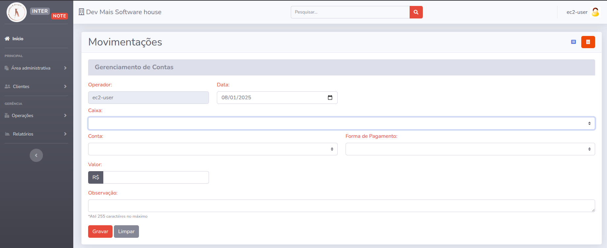

# Inter Note — Aesthetic Clinic Management Software
Inter Note is a management system designed for aesthetic clinics. It includes features for cash flow control and appointment management, with roles for both professionals and supervisors.

✅ Requirements
Before running the application, ensure the following are installed on your system:

- Docker
- Docker Compose
- PHP version: 8.1.3
- Laravel version: 8.83.27

## 🚀 Project Preview


## Installation and Setup

### 1. Clone the repository
```
git clone https://github.com/{usuario}/Sales-Expert.git
cd Sales-Expert
cp .env.example .env
```

### 2. Environment configuration
```
cp .env.example .env
```

### 3. Start the containers and prepare the app
Run the following commands to start the Docker environment and install dependencies:
```
docker-compose up -d --build
```
Access the app container:
```
docker exec -it laravel_app bash
```
Inside the container, run:
```
composer install
php artisan key:generate
php artisan migrate
php artisan db:seed
```

## 🌐 Accessing the Application
If everything is set up correctly, the application will be available at:
```
http://localhost:8080
```